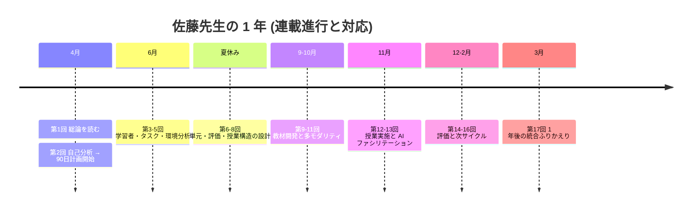
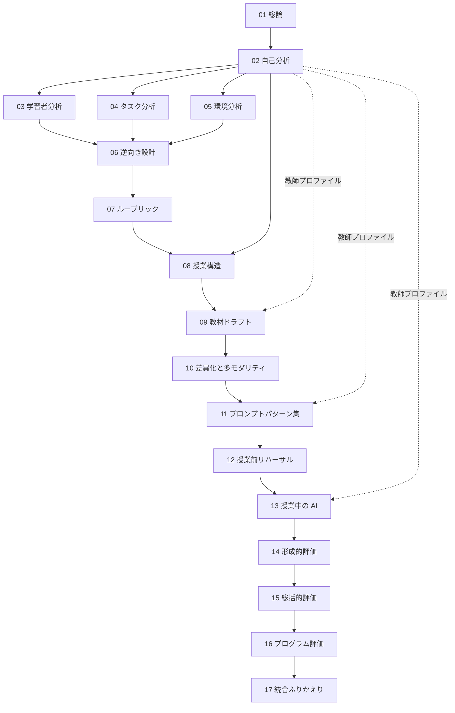

# 連載全体設計: 生成AI時代の ADDIE モデル (Series Plan)

第1回・第2回の内容と、そこで示した **5 つの設計原則** を土台に、
連載全体 (第3回〜最終回) を設計する。読者が本連載を通読したとき、
**ADDIE の 5 フェーズすべてを AI 支援下で実行できるようになる** ことをゴールとする。

- **最終更新:** 2026-07-11
- **著者:** nahisaho
- **ライセンス:** [CC BY-NC 4.0](../LICENSE)

---

## 1. 設計方針

### 1.1 継承する枠組み (第1回)

すべての記事は [第1回](../articles/01-instructional-design-and-generative-ai/README.md) で示した
**5 つの設計原則** を貫く。

1. **AI は「材料」を出し、教師は「判断」を出す**
2. **反証プロンプトを必ず併用する**
3. **教師個人プロファイルを AI 活用の起点にする** (第2回の自己分析結果を再利用)
4. **撤退基準を設計段階で決めておく**
5. **学習者データの取り扱いは最小権限で**

### 1.2 物語スパイン: 佐藤先生の 1 年

第2回で導入した **佐藤 美咲先生 (公立高校 国語 8 年目)** を通じて連載全体を貫く。
各回は独立して読めるが、通読すると **佐藤先生の 1 年間の AI 統合ジャーニー** になる。

### 1.3 記事構造の標準テンプレート

第2回で機能した構造をテンプレート化し、第3回以降でも採用する。

1. **要約 (TL;DR)** — 3〜5 行
2. **理論的背景** — 教育学の一次文献に基づく短い解説
3. **物語 (佐藤先生の場面)** — 動機と課題
4. **プロンプト実行** — 実際の入出力を掲載
5. **反証プロンプト** — 追従バイアス対策 (原則 2)
6. **運用への落とし込み** — 撤退基準を含む (原則 4)
7. **限界と留意点**
8. **参考文献**
9. **付録: 実行ログ** (`examples/`) — 長い出力を分離

### 1.4 記事間の依存関係

---

## 2. Analysis フェーズ (第3〜5回)

第2回で **教師** の分析を終えた佐藤先生が、**学習者・タスク・環境** の 3 つの
古典的分析対象を AI 支援下で行う。

### 第3回: Analysis — 学習者分析 (Learner Analysis)

- **サブタイトル:** 40 人の顔を思い浮かべる — AI で描く「学級プロファイル」
- **主題:** 個々の学習者像と集団としての学級像を、既有データ + 教師の観察メモから
  AI に整理させる。名指しでの機微データは投入しない (原則 5)。
- **教育学枠組み:**
  - Vygotsky の ZPD (発達の最近接領域) [[Vygotsky 1978]](../shared/references.md#vygotsky-1978)
  - Universal Design for Learning (UDL) の 3 原則
- **物語:** 佐藤先生は 4 月に新しい学年を受け持つ。前担任からの引継ぎ資料と
  自分の観察メモから、40 人分の「学級プロファイル」を作りたい。
- **主要プロンプト:**
  - `01-class-profile-synthesizer.md` — 匿名化されたメモから学級傾向を抽出
  - `02-zpd-hypothesis-generator.md` — 単元ごとの ZPD 仮説を生成
  - `03-udl-diversity-checker.md` — UDL 観点でカバー漏れを洗い出す
- **反証:** 「あなたの仮説が過大一般化している可能性を挙げよ」
- **想定文量:** 8,000〜10,000 字

### 第4回: Analysis — タスク分析 (Task Analysis)

- **サブタイトル:** 到達目標を "動詞" まで分解する — Bloom × AI の下位スキル抽出
- **主題:** 単元の到達目標を、観察可能な行動 (動詞) レベルまで階層分解し、
  下位スキル・前提知識を可視化する。
- **教育学枠組み:**
  - Bloom's Taxonomy 改訂版 [[Anderson & Krathwohl 2001]](../shared/references.md#anderson-krathwohl-2001)
  - Gagné の学習成果 5 分類
- **物語:** 「批判的思考を伸ばす」という漠然とした目標を、
  国語の単元「羅生門」で **何ができれば良いのか** に翻訳する。
- **主要プロンプト:**
  - `01-goal-decomposer.md` — 抽象目標を Bloom 動詞に展開
  - `02-prerequisite-mapper.md` — 前提知識・下位スキルの依存グラフを生成
  - `03-observable-behavior-check.md` — 「観察可能か」を厳格に問う
- **反証:** 「分解が過剰で学習者の全体像を失っていないか」
- **想定文量:** 7,000〜9,000 字

### 第5回: Analysis — 環境・制約分析 (Context Analysis)

- **サブタイトル:** 教室の外側を設計する — 時間・機材・組織・法制・倫理
- **主題:** AI 導入時に無視されがちな **非教育的制約** (勤務時間、機材、
  校則、著作権、生徒プライバシー) を体系的に洗い出す。
- **教育学枠組み:**
  - Actor-Network Theory の教育応用
  - 生成 AI と教育に関する UNESCO ガイダンス [[UNESCO 2023]](../shared/references.md#unesco-2023)
- **物語:** ある日、生徒が「先生の指示で ChatGPT を使ったら親に叱られた」と
  相談してきた。**校則・保護者・法制** の観点を整理する必要が出てくる。
- **主要プロンプト:**
  - `01-constraint-map.md` — 5 レイヤー (時間/機材/組織/法制/倫理) で制約列挙
  - `02-stakeholder-communication.md` — 保護者・管理職への説明文生成
  - `03-data-minimization-checklist.md` — データ最小権限の実装確認
- **反証:** 「見落としている制約がないか — 少数派の学習者視点から」
- **想定文量:** 7,000〜9,000 字

---

## 3. Design フェーズ (第6〜8回)

Analysis の 4 つの成果物 (教師/学習者/タスク/環境) を入力として、
**単元設計 → 評価設計 → 授業構造** の順に降ろす。

### 第6回: Design — 逆向き設計 (Backward Design)

- **サブタイトル:** 「終わり」から描く単元 — AI と組む Backward Design
- **主題:** Wiggins & McTighe の 3 段階 (①到達目標 → ②評価 → ③指導計画) を
  AI と共同実施する。
- **教育学枠組み:**
  - Understanding by Design [[Wiggins & McTighe 2005]](../shared/references.md#wiggins-mctighe-2005)
- **物語:** 佐藤先生が「羅生門」単元 (全 8 コマ) を Backward Design で組み直す。
- **主要プロンプト:**
  - `01-enduring-understanding.md` — 単元の Enduring Understanding を言語化
  - `02-essential-question.md` — Essential Question の候補生成
  - `03-backward-outline.md` — 3 段階の下書きを生成
- **反証:** 「Enduring Understanding が教科の本質と乖離していないか」
- **想定文量:** 8,000〜10,000 字

### 第7回: Design — ルーブリックの共同設計

- **サブタイトル:** 生徒とつくる評価 — AI 下書き → 学習者交渉 → 教師確定
- **主題:** ルーブリックを教師が独占せず、AI 下書きを学習者と交渉する 3 段階
  ワークフロー。
- **教育学枠組み:**
  - 形成的評価 [[Black & Wiliam 1998]](../shared/references.md#black-wiliam-1998)
  - Co-constructed rubrics の研究
- **物語:** 「羅生門」レポートのルーブリックを、AI 下書き → 生徒 4 名で交渉
  → クラス提示、の流れで作る。
- **主要プロンプト:**
  - `01-rubric-draft-from-goals.md` — 到達目標からルーブリック生成
  - `02-student-friendly-rewrite.md` — 生徒に読める文体へ書き換え
  - `03-negotiation-facilitator.md` — 生徒交渉セッションのファシリ支援
- **反証:** 「評価基準がハイ・アチーバー偏重になっていないか」
- **想定文量:** 8,000〜10,000 字

### 第8回: Design — 授業構造 (Gagné × Merrill × AI)

- **サブタイトル:** 1 コマの骨格を設計する — 9 事象と First Principles
- **主題:** 個々の授業 (50〜100 分) の構造を、Gagné の 9 事象と Merrill の
  First Principles を組み合わせて設計する。
- **教育学枠組み:**
  - Gagné's Nine Events of Instruction
  - Merrill's First Principles [[Merrill 2002]](../shared/references.md#merrill-2002-placeholder)
- **物語:** 「羅生門」第3コマを、佐藤先生の教授スタイル (第2回プロファイル)
  に合わせて設計する。
- **主要プロンプト:**
  - `01-nine-events-scaffold.md` — 9 事象の枠に授業内容を配置
  - `02-teacher-profile-adaptation.md` — 第2回の教師プロファイルで最適化
  - `03-attention-hook-generator.md` — 導入 (Gain Attention) の候補生成
- **反証:** 「事象の充填が形式的になり、学習者の思考時間が削られていないか」
- **想定文量:** 8,000〜10,000 字

---

## 4. Development フェーズ (第9〜11回)

設計文書 (第6-8回の成果物) から、実際の教材を AI で下書きし、
査読・多モダリティ化・パターン化する。

### 第9回: Development — 教材ドラフトと査読ループ

- **サブタイトル:** 良い下書きは "良い査読" が作る — AI + 教師 + 同僚の三角査読
- **主題:** ワークシート・スライド・小テストの下書きを AI で生成し、
  教師 → 同僚 → 生徒モニターの **3 段階査読** で整えるワークフロー。
- **教育学枠組み:** 教材評価の Kirkpatrick Level 1 (反応)
- **物語:** 「羅生門」ワークシート初版を 30 分で生成、翌週の学年会で査読、
  実施前に生徒 3 名モニター。
- **主要プロンプト:**
  - `01-worksheet-draft.md` — 授業構造 (第8回) からワークシート生成
  - `02-peer-review-checklist.md` — 同僚査読用チェックリスト生成
  - `03-student-monitor-questions.md` — 生徒モニター用 5 問生成
- **反証:** 「AI 生成物のトーンが教師の授業と乖離していないか」
- **想定文量:** 8,000〜10,000 字

### 第10回: Development — 差異化と多モダリティ

- **サブタイトル:** MI 補完としての AI — 空間・身体・音声への拡張
- **主題:** 第2回で判明した **教師の弱いモダリティ** を AI で補完する。
  佐藤先生の場合は空間 (2.5) と身体運動 (2.0)。
- **教育学枠組み:**
  - UDL の Multiple Means of Representation
  - MI 理論の教授方略への活用 (批判点も併記)
- **物語:** 「羅生門」で図解と身体表現の活動を AI 補助で導入。
  効果を生徒アンケートで検証。
- **主要プロンプト:**
  - `01-modality-gap-filler.md` — 教師プロファイルから弱いモダリティを補う教材案
  - `02-visual-diagram-brief.md` — 空間表現の下書き (画像生成 AI 向け brief)
  - `03-differentiation-tiers.md` — 到達目標を保ちつつ 3 段階の難易度に分岐
- **反証:** 「差異化が学習者のラベリングになっていないか」
- **想定文量:** 8,000〜10,000 字

### 第11回: Development — プロンプト・パターンカタログ (中間ふりかえり)

- **サブタイトル:** 使える型を貯める — 教材タイプ別プロンプトカタログ
- **主題:** 第9-10 回までに登場したプロンプトを、教材タイプ (発問/ワークシート/
  スライド/評価) × 教科 × 学年でカタログ化。
- **教育学枠組み:** Prompt Pattern Catalog [[White et al. 2023]](../shared/references.md#white-2023)
- **物語:** 佐藤先生と学年の同僚 3 名で「校内プロンプト辞書」を作り始める。
- **主要プロンプト:**
  - `01-pattern-extractor.md` — 過去出力から共通パターンを抽出
  - `02-catalog-entry-template.md` — カタログ 1 エントリの標準構造
- **想定文量:** 6,000〜8,000 字 (カタログ主体)

---

## 5. Implementation フェーズ (第12〜13回)

授業実施の前後・最中の AI 活用。**教師の情動応答領域は守る** (第2回 At-Risk #1)。

### 第12回: Implementation — 授業前リハーサル

- **サブタイトル:** AI 学習者と話す夜 — シミュレーションで発問を鍛える
- **主題:** AI に学習者役を演じさせ、教師が発問リハーサルを行う。
  想定外の反応を洗い出す。
- **教育学枠組み:** Micro-teaching, Cognitive Apprenticeship の Modeling
  [[Collins, Brown & Newman 1989]](../shared/references.md#collins-brown-newman-1989)
- **物語:** 佐藤先生が明日の授業前夜、AI に「反抗的な生徒」「消極的な生徒」
  「早解き生徒」の 3 役を演じさせて発問を試す。
- **主要プロンプト:**
  - `01-learner-persona-simulator.md` — 学級プロファイル (第3回) からペルソナ生成
  - `02-question-stress-test.md` — 発問を 3 ペルソナで試す
  - `03-facilitation-move-menu.md` — 予期しない応答への Facilitation Move カード生成
- **反証:** 「シミュレーションが実際の学級より単純化されすぎていないか」
- **想定文量:** 8,000〜10,000 字

### 第13回: Implementation — 授業中の AI ファシリテーション

- **サブタイトル:** 教壇に AI を置かない — バックステージとしての活用
- **主題:** 授業中に AI を **可視化しない** 形で使う (教師のイヤホン Copilot、
  生徒側は既存教材のみ)。学級経営の情動情報は AI に流さない (第2回原則)。
- **教育学枠組み:** Just-in-Time Teaching, 授業中の Formative Assessment
- **物語:** 佐藤先生が授業中に AI で発問候補を素早く出し、生徒の反応で選ぶ。
- **主要プロンプト:**
  - `01-in-class-quick-question.md` — 30 秒で次の発問候補 3 つ
  - `02-exit-ticket-generator.md` — 授業末の Exit Ticket を即時生成
  - `03-post-class-log-template.md` — 5 分で書ける授業ログのテンプレ
- **反証:** 「AI 提案の採用率が高すぎて、教師の即興性が失われていないか」
- **想定文量:** 8,000〜10,000 字

---

## 6. Evaluation フェーズ (第14〜16回)

形成的 → 総括的 → プログラム全体、と粒度を上げて評価する。

### 第14回: Evaluation — 形成的評価と即時フィードバック

- **サブタイトル:** 30 人分の作文に、30 分でフィードバックを返す
- **主題:** 記述式回答への一次コメントを AI で下書きし、教師が最終署名する
  ワークフロー。**評価判断は教師** (第1回原則 1)。
- **教育学枠組み:** 形成的評価 [[Black & Wiliam 1998]](../shared/references.md#black-wiliam-1998)
- **物語:** 中間レポート 30 通に、翌週返却でコメントを返す運用。
- **主要プロンプト:**
  - `01-rubric-anchored-feedback.md` — ルーブリック (第7回) 準拠のコメント生成
  - `02-growth-focused-rewrite.md` — 減点主義から成長焦点への書き換え
  - `03-teacher-signature-check.md` — 教師が最終確認するチェック項目
- **反証:** 「AI コメントが平均化され、個別性が失われていないか」
- **想定文量:** 8,000〜10,000 字

### 第15回: Evaluation — 総括的評価とポートフォリオ

- **サブタイトル:** 数字の裏にある物語 — 成長ナラティブの共同執筆
- **主題:** 学期末の総括評価で、点数だけでなく **成長物語 (Learning Narrative)** を
  AI と教師で共同執筆し、学習者・保護者に届ける。
- **教育学枠組み:** Assessment for Learning, Narrative Assessment
- **物語:** 学期末、佐藤先生が 40 人分の成長物語を書く。
- **主要プロンプト:**
  - `01-portfolio-synthesizer.md` — 学習ログから成長軌跡を抽出
  - `02-narrative-drafter.md` — 保護者向けの物語風レポート下書き
  - `03-privacy-redactor.md` — 提出前の個人情報チェック
- **反証:** 「物語が過度にポジティブに整形され、現実を歪めていないか」
- **想定文量:** 8,000〜10,000 字

### 第16回: Evaluation — プログラム評価と次サイクルへ

- **サブタイトル:** ADDIE を回し続ける — Kirkpatrick 4 レベル × AI
- **主題:** 単元・学期の枠を超え、**この単元設計そのものを評価** する。
  Kirkpatrick の 4 レベル (反応/学習/行動/成果) を AI 支援で回す。
- **教育学枠組み:** Kirkpatrick's Four-Level Training Evaluation Model
- **物語:** 佐藤先生が「羅生門」単元全体を評価し、次年度の改良点を決める。
- **主要プロンプト:**
  - `01-level1-2-analyzer.md` — 生徒アンケート + 到達度データの統合分析
  - `02-level3-classroom-behavior.md` — 授業観察ログからの行動変容抽出
  - `03-improvement-backlog.md` — 次サイクルの改善バックログ生成
- **反証:** 「改善点の列挙が教師の労力を無視して肥大化していないか」
- **想定文量:** 8,000〜10,000 字

---

## 7. 統合ふりかえり (最終回 第17回)

### 第17回: 佐藤先生の 1 年後

- **サブタイトル:** プロファイルを更新する日 — 連載を貫く 1 年のふりかえり
- **主題:**
  - 第2回の 16Personalities + MI 診断を **再受検**
  - プロンプト 01 を **再実行** して自己プロファイルの更新を確認
  - 第2〜16 回の運用ログをまとめて **教師個人カリキュラム** に翻訳
  - 連載の 5 原則が実際にどう機能したかを検証
- **物語:** 佐藤先生が 3 月の春休みに、1 年分のノートを開く。
- **主要プロンプト:**
  - `01-year-in-review-synthesizer.md` — 全プロンプト出力のメタ分析
  - `02-profile-diff-explainer.md` — 前後のプロファイル差分を解釈
  - `03-next-year-manifesto.md` — 次年度の 1 ページ宣言文
- **想定文量:** 6,000〜8,000 字 (物語中心)

---

## 8. 記事一覧 (完全版)

| # | フェーズ | サブタイトル (短) | 状態 |
| :-: | :------ | :---------------- | :--: |
| 01 | 総論 | Instructional Design と生成 AI | 公開 |
| 02 | Analysis | 教師の自己分析 | 公開 |
| 03 | Analysis | 学習者分析 | 準備中 |
| 04 | Analysis | タスク分析 | 準備中 |
| 05 | Analysis | 環境・制約分析 | 準備中 |
| 06 | Design   | 逆向き設計 | 準備中 |
| 07 | Design   | ルーブリックの共同設計 | 準備中 |
| 08 | Design   | 授業構造 (Gagné × Merrill) | 準備中 |
| 09 | Development | 教材ドラフトと査読ループ | 準備中 |
| 10 | Development | 差異化と多モダリティ | 準備中 |
| 11 | Development | プロンプト・パターンカタログ | 準備中 |
| 12 | Implementation | 授業前リハーサル | 準備中 |
| 13 | Implementation | 授業中の AI ファシリテーション | 準備中 |
| 14 | Evaluation | 形成的評価 | 準備中 |
| 15 | Evaluation | 総括的評価とポートフォリオ | 準備中 |
| 16 | Evaluation | プログラム評価と次サイクル | 準備中 |
| 17 | ふりかえり | 佐藤先生の 1 年後 | 準備中 |

## 9. 執筆順序の推奨

読者価値と依存関係から、次の順序を推奨する。

1. **フェーズ縦割り執筆** (1 フェーズを完成させてから次へ) — Analysis → Design → …
2. 各フェーズ内は **番号順**
3. 第11回 (パターンカタログ) は第9-10 回の後で必ず入れる — 学習の定着点
4. 第17回は他のすべての公開後に執筆

## 10. 変更管理

- 本計画は **設計仮説** であり、読者フィードバックや実践知見で更新される
- 大きな変更 (回の追加/削除/順序変更) はコミットメッセージに `series-plan:` プレフィックスを付ける
- 各記事のヘッダにも「本記事は Series Plan v<N> に基づく」と記す運用は行わない
  (変更が煩雑になるため)。ルート [`README.md`](../README.md) の一覧を正とする。
